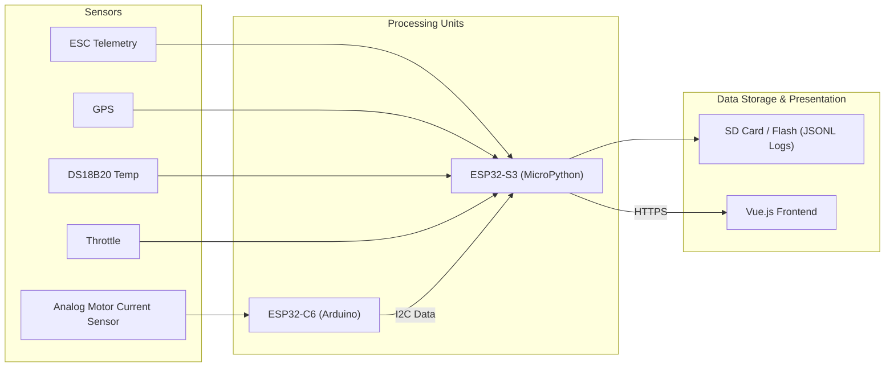

# E-Foil/Foil-Assist Data Logger & Analyzer

## Introduction

This project is a comprehensive system designed for logging and analyzing sensor data from an e-foil or foil-assist. The primary goal is to capture detailed performance metrics, including ESC (Electronic Speed Controller) data, GPS location, temperature, motor current, and throttle input, to provide a clear and useful presentation for performance analysis and system optimization.

The system utilizes a dual ESP32 setup for robust data acquisition and a web-based frontend for intuitive data visualization.

## Key Components

The system is comprised of several key hardware and software components:

### 1. ESP32-S3 (MicroPython - `device/`)

- **Role:** Main controller, data aggregator, Wi-Fi communication hub, and HTTPS server.
- **Key Functionalities:**
  - Integrates and reads data from various sensors:
    - ESC Telemetry (e.g., RPM, voltage, current, temperature from the ESC)
    - GPS (for location and speed)
    - DS18B20 Temperature Sensors
    - Throttle Position
  - Acts as an I2C master to communicate with the ESP32-C6 for additional ADC readings (primarily motor current).
  - Manages data logging, typically to an SD card or internal flash memory in `*.jsonl` format.
  - Provides a Wi-Fi Access Point (AP) for initial setup or direct connection.
  - Connects to an existing Wi-Fi network (Station mode) for broader network access.
  - Serves data and potentially a web interface via a built-in HTTPS server.

### 2. ESP32-C6 (Arduino - `arduino/`)

- **Role:** Dedicated ADC (Analog-to-Digital Converter) processor.
- **Key Functionalities:**
  - Acquires analog sensor data, primarily high-frequency motor current readings (e.g., via an ACS758 sensor).
  - Acts as an I2C slave, providing the processed ADC data to the ESP32-S3 upon request.

### 3. Vue.js Frontend (`chart/`)

- **Role:** Data visualization and user interface.
- **Key Functionalities:**
  - Displays logged and potentially live sensor data through interactive charts and graphs.
  - Accessible via: [https://esp-e90.pages.dev/](https://esp-e90.pages.dev/)

### 4. Utility Scripts (`scripts/`)

- **Role:** A collection of shell scripts to aid in development and device management.
- **Examples:** Flashing firmware, synchronizing files to the ESP32 devices, etc.

### 5. Experimental Components (`idf/`, `rust/`, `zig/`)

- These directories contain experimental code using ESP-IDF (C), Rust, and Zig for the ESP32 platform. They are not part of the core operational system but serve as a testbed for alternative firmware development approaches.

## System Architecture & Data Flow

The general data flow is as follows:



1.  The **ESP32-C6** reads analog sensor data (e.g., motor current) and processes it.
2.  The **ESP32-S3** reads data directly from digital sensors (ESC, GPS, Temp, Throttle).
3.  The **ESP32-S3** also requests the processed ADC data from the ESP32-C6 via I2C.
4.  All aggregated data on the **ESP32-S3** is logged (e.g., to an SD card).
5.  The **ESP32-S3**'s HTTPS server can serve this data (live or logged) to the **Vue.js Frontend** for visualization.

## Getting Started / Setup

### Prerequisites

**Hardware:**

- ESP32-S3 development board
- ESP32-C6 development board
- Associated sensors (ESC, GPS module, DS18B20, motor current sensor like ACS758, throttle input mechanism)
- Appropriate wiring, power supplies, and level shifters if necessary.
- MicroSD card (if SD logging is used on the ESP32-S3).

**Software:**

- Python 3.x
- `esptool.py`: For flashing ESP32 firmware. Install via pip: `pip install esptool`
- `mpremote`: For interacting with MicroPython devices (file transfer, REPL). Install via pip: `pip install mpremote`
  - (Alternatively, `ampy` can be used, though `mpremote` is generally preferred for newer MicroPython versions).
- Arduino IDE or `arduino-cli`: For compiling and uploading firmware to the ESP32-C6.
- Node.js and pnpm: If you intend to run or develop the Vue.js frontend locally.

### ESP32-S3 (MicroPython) Setup

1.  **Flash MicroPython Firmware:**

    - Download a suitable MicroPython firmware binary for the ESP32-S3 (generic S3 build, preferably with SPIRAM support).
    - Connect the ESP32-S3 to your computer. Identify its serial port (e.g., `/dev/tty.usbmodemXXXX` on macOS/Linux, `COMX` on Windows).
    - Erase the flash:
      ```bash
      esptool.py --chip esp32s3 --port /YOUR_ESP32S3_PORT erase_flash
      ```
    - Write the new firmware (replace `ESP32_GENERIC_S3-VERSION.bin` with your downloaded file):
      ```bash
      esptool.py --chip esp32s3 --port /YOUR_ESP32S3_PORT --baud 460800 write_flash -z 0x0 ESP32_GENERIC_S3-VERSION.bin
      ```
      _(Refer to `doc.md` for more specific `esptool.py` commands if needed, adjusting for ESP32-S3)._

2.  **Deploy MicroPython Code:**
    - The MicroPython code for the ESP32-S3 is located in the `device/` directory.
    - Use `mpremote` to copy the files. Connect to the ESP32-S3's REPL using `mpremote connect /YOUR_ESP32S3_PORT` first, or specify the port in each command.
    - To copy all files and directories from `device/` to the root of the MicroPython filesystem:
      ```bash
      mpremote fs cp -r device/* :
      ```
    - Alternatively, use the synchronization scripts provided in the `scripts/` directory if available and configured.

### ESP32-C6 (Arduino) Setup

1.  **Configure Arduino Environment:**
    - Ensure you have the ESP32 board support package installed in your Arduino IDE or for `arduino-cli`. You'll need support for ESP32-C6.
    - Select the correct board (ESP32-C6 based) and port in the Arduino IDE.
2.  **Upload Arduino Sketch:**
    - Open the sketch located at `arduino/sketch/sketch.ino` in the Arduino IDE.
    - Compile and upload the sketch to the ESP32-C6.

### Vue.js Frontend (`chart/`)

- **Accessing the Deployed App:**
  The application is live and can be accessed at: [https://esp-e90.pages.dev/](https://esp-e90.pages.dev/)
- **(Optional) Running Locally:**
  If you want to run the frontend locally for development or offline use:
  1.  Navigate to the chart directory: `cd chart/`
  2.  Install dependencies: `pnpm install` (ensure you have pnpm installed: `npm install -g pnpm`)
  3.  Start the development server: `pnpm dev`
  4.  Open your browser to the local address provided (usually `http://localhost:5173`).

## Usage

1.  **Power On:** Ensure both ESP32 devices are powered correctly and all sensors are connected.
2.  **Connectivity:**
    - The ESP32-S3 will start a Wi-Fi Access Point (default SSID: `DDDEV`, password: `aaaaaaaa` - check `device/ap.py` or `device/main.py` for current settings). Connect your computer or mobile device to this AP.
    - Alternatively, if configured, the ESP32-S3 may connect to an existing Wi-Fi network (STA mode).
3.  **Accessing Data:**
    - Once connected to the same network as the ESP32-S3, you can access data or interfaces provided by its HTTPS server. The specific IP address and endpoints will depend on your network configuration and the server implementation in `device/http_server.py`.
    - For visualizing data, use the deployed Vue.js app: [https://esp-e90.pages.dev/](https://esp-e90.pages.dev/). This app will likely fetch data logs or connect to a live data stream from the ESP32-S3 if properly configured.
4.  **Data Logging:**
    - Data is logged in `*.jsonl` (JSON Lines) format.
    - Check the `device/io_local/data_log.py` module for specifics on log file naming, storage location (e.g., `/sd/logs/` if an SD card is used), and rotation.

## Development

- **MicroPython (`device/`):**
  - Use `mpremote` for file management and accessing the REPL.
  - Follow MicroPython best practices. The code utilizes `uasyncio` for cooperative multitasking.
- **Arduino (`arduino/`):**
  - Standard Arduino C++ development using the Arduino IDE or `arduino-cli`.
  - The ESP32-C6 code uses FreeRTOS tasks for ADC processing and I2C communication.
- **Utility Scripts (`scripts/`):**
  - Explore the scripts in this directory for managing and automating development tasks. They may require some configuration (e.g., serial ports).

## Troubleshooting

- **No Wi-Fi AP:** Check LED status on ESP32-S3, ensure `device/ap.py` and `device/main.py` are correctly uploaded and `boot.py` is not preventing `main.py` from running.
- **Cannot Connect to HTTPS Server:** Verify IP address, firewall settings. Check logs on ESP32-S3 via REPL if possible.
- **Sensor Data Issues:**
  - Double-check wiring for all sensors.
  - Verify I2C addresses and communication between ESP32-S3 and ESP32-C6.
  - Inspect individual sensor reader modules in `device/io_local/` and `arduino/sketch/` for debugging logic or pin configurations.
- **Flashing Issues:** Ensure correct `esptool.py` commands, serial port, and that the ESP32 is in bootloader mode if required.

## Contributing

(Placeholder: Add guidelines for contributions if this project is open to it, e.g., coding standards, pull request process.)

## License

(Placeholder: Specify the license for this project, e.g., MIT, GPL, Apache 2.0.)
