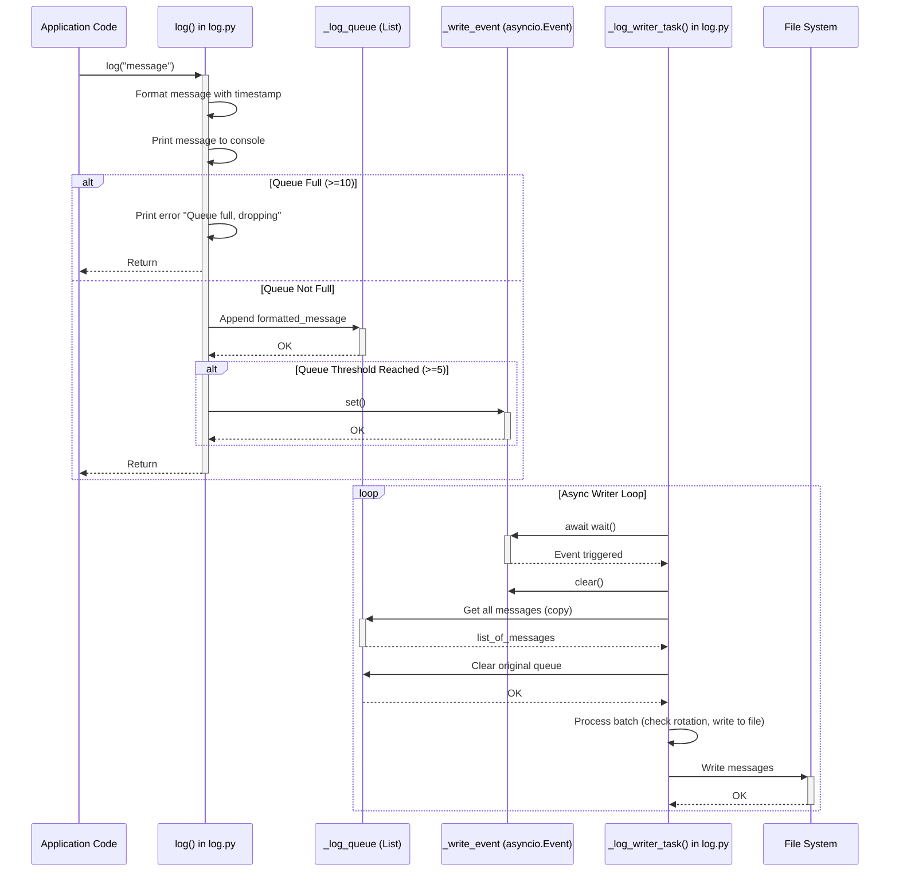

# Asynchronous Logging Plan

**Goal:** Modify the logging system to use a simple in-memory list as a queue (max size 10) and a separate asynchronous task that writes logs to the file system in batches when the queue size reaches 5.

**Architecture:**

**Detailed Plan:**

1.  **Modify `device/log.py`:**

    - **Import `uasyncio`**.
    - **Create Globals:**
      - `_log_queue = []` (Standard list for the queue)
      - `_MAX_QUEUE_SIZE = 10`
      - `_WRITE_THRESHOLD = 5`
      - `_write_event = asyncio.Event()` (Signal for the writer task)
    - **Modify `log(\*args, **kwargs)` function:\*\*
      - Keep timestamp formatting and console print.
      - Check queue size: `if len(_log_queue) >= _MAX_QUEUE_SIZE:`.
        - If full, print an error message (e.g., `f"Log queue full (size {_MAX_QUEUE_SIZE}). Dropping message: {message}"`) and `return`.
      - If not full, append the formatted `output_bytes` to `_log_queue`.
      - Check threshold: `if len(_log_queue) >= _WRITE_THRESHOLD:`.
        - If threshold met, set the event: `_write_event.set()`.
    - **Create `_log_writer_task()` async function:**
      - Call `_ensure_log_dir()` and initialize `_current_log_index = get_latest_log_index()`.
      - Start `while True:` loop.
      - `await _write_event.wait()`: Wait for the signal.
      - `_write_event.clear()`: Clear the signal immediately.
      - **Process Batch:**
        - `messages_to_write = _log_queue[:]` (Copy all messages currently in the queue).
        - `_log_queue.clear()` (Clear the original queue).
        - If `not messages_to_write: continue` (Safety check).
        - Iterate through `message_bytes` in `messages_to_write`:
          - Get `current_filepath = _get_log_filepath(_current_log_index)`.
          - Check current file size using `uos.stat(current_filepath)` (handle `OSError` for non-existent file, setting `current_size = 0`).
          - Check rotation: `if current_size > 0 and (current_size + len(message_bytes)) > MAX_LOG_FILE_SIZE:`.
            - If rotation needed: increment `_current_log_index`, get new `current_filepath`, print rotation message, `gc.collect()`.
          - Write the `message_bytes` to the (potentially new) `current_filepath` using `with open(..., "ab") as f: f.write(...)`.
          - Include `try...except` around file operations and print errors if they occur.

2.  **Modify `device/main.py`:**
    - Ensure `_log_writer_task` is imported from `device.log`.
    - Start the task using `asyncio.create_task(log._log_writer_task())` within `async def main()`.
