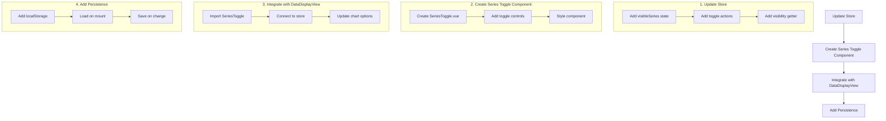

# Toggle Series Implementation Plan

## Overview

Implement functionality to allow users to toggle the visibility of individual data series in the chart visualization.

## Current Architecture

- Chart data managed in sessionData Pinia store
- Chart options configured in DataDisplayView.vue
- Chart rendering handled by SensorChart.vue using ECharts
- Series currently always visible, controlled by legend

## Implementation Steps



### 1. Update Session Data Store

```typescript
// Add to state:
visibleSeries: Set<string> // Stores names of visible series

// Add actions:
toggleSeries(seriesName: string): void
toggleAllSeries(visible: boolean): void
setSeriesVisibility(seriesName: string, visible: boolean): void

// Add getter:
getVisibleSeries: (state) => string[]
```

### 2. Create Series Toggle Component

Create new SeriesToggle.vue component:

- Toggle switches for each series
- Group toggles by category (ESC, Temperature, GPS)
- "Toggle All" functionality
- Styled using Naive UI components

### 3. Integrate with DataDisplayView

- Import and place SeriesToggle component
- Update chart options to filter series based on visibility
- Add reactive connection to store's visibility state

### 4. Add Persistence Layer

- Save visibility preferences to localStorage
- Load preferences on component mount
- Update storage when preferences change

## Technical Considerations

1. Performance

    - Use computed properties for filtering visible series
    - Optimize reactivity by using Set for visibility state

2. UX Design

    - Group related series together
    - Clear visual indication of toggle state
    - Smooth transitions when toggling

3. State Management

    - Keep visibility state in Pinia store
    - Ensure proper reactivity with ECharts
    - Handle initial state loading

4. Data Organization
    - Group series by type:
        - ESC metrics (RPM, Current, Voltage, Temperature)
        - Temperature sensors
        - GPS data
        - Motor metrics
        - Throttle data

## Implementation Details

### Store Updates

```typescript
interface State {
	visibleSeries: Set<string>
	// ... existing state
}

const actions = {
	toggleSeries(seriesName: string) {
		const isVisible = this.visibleSeries.has(seriesName)
		this.setSeriesVisibility(seriesName, !isVisible)
	},

	toggleAllSeries(visible: boolean) {
		const allSeries = this.getChartFormattedData.series.map((s) => s.name)
		if (visible) {
			allSeries.forEach((name) => this.visibleSeries.add(name))
		} else {
			this.visibleSeries.clear()
		}
	},

	setSeriesVisibility(seriesName: string, visible: boolean) {
		if (visible) {
			this.visibleSeries.add(seriesName)
		} else {
			this.visibleSeries.delete(seriesName)
		}
		this.saveVisibilityPreferences()
	},
}
```

### Component Structure

```vue
<!-- SeriesToggle.vue -->
<template>
	<n-card title="Series Visibility">
		<n-space vertical>
			<n-button @click="toggleAll">Toggle All</n-button>

			<!-- ESC Metrics -->
			<n-collapse-item title="ESC Metrics">
				<n-space vertical>
					<n-switch
						v-for="series in escSeries"
						:key="series"
						v-model:value="isVisible[series]"
						@update:value="toggleSeries(series)"
					>
						{{ series }}
					</n-switch>
				</n-space>
			</n-collapse-item>

			<!-- Temperature Sensors -->
			<!-- GPS Data -->
			<!-- Motor Metrics -->
			<!-- Throttle Data -->
		</n-space>
	</n-card>
</template>
```

### Chart Integration

```typescript
// In DataDisplayView.vue
const filteredChartOptions = computed(() => {
	if (!chartOptions.value) return null

	return {
		...chartOptions.value,
		series: chartOptions.value.series.filter((s) => sessionDataStore.visibleSeries.has(s.name)),
	}
})
```
