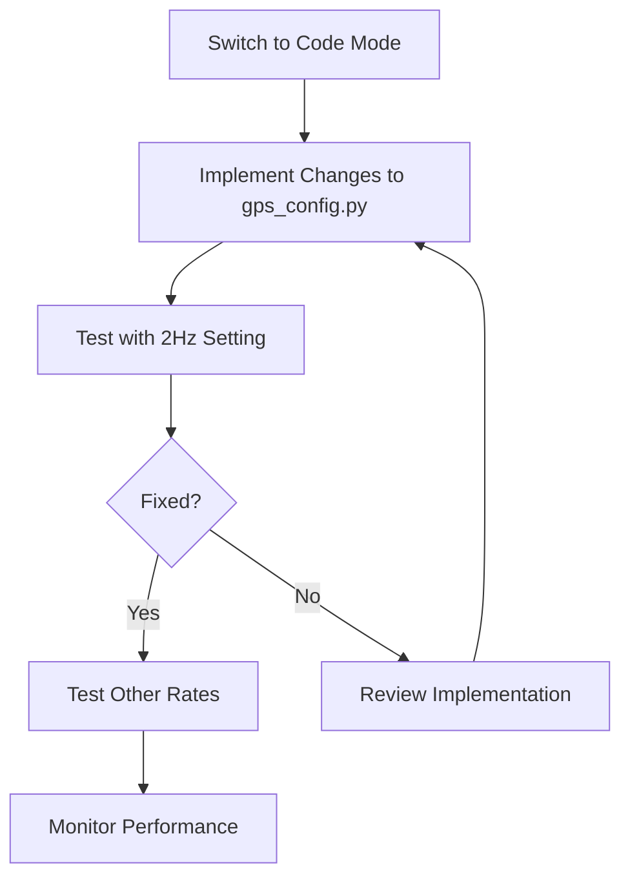

# GPS Rate Setting Issue - Summary

## Root Causes Identified

After analyzing the code and comparing it with the u-blox documentation, I've identified these key issues:

1. **Incorrect Checksum Calculation**: The current checksum calculation doesn't match the expected values for u-blox NEO-7M commands.

2. **UBX Message Structure Issues**: The message construction doesn't properly follow the u-blox protocol format.

3. **No Buffer Management**: The UART buffer isn't cleared before sending commands, which can cause interference.

4. **Insufficient Error Handling**: No retry mechanism or proper error recovery when commands fail.

## Expected Behavior vs. Current Behavior

- **Expected**: Setting the GPS rate to 2Hz should be acknowledged by the module and result in data being sent at 2Hz.
- **Current**: The command is sent but times out waiting for ACK, and the rate remains at 1Hz.

## Evidence

- The command being sent (`b56206080600f401010001000b77`) has a different checksum compared to what's expected according to the documentation (`B5 62 06 08 06 00 F4 01 01 00 01 00 0E 66`).
- Checksum errors appear in the logs when trying to change the rate.
- The timeout error indicates the GPS module isn't properly acknowledging the command.

## Comprehensive Solution

I've created a detailed implementation plan in `gps_fix_implementation_plan.md` that includes code samples for:

1. Fixing the checksum calculation
2. Correcting the UBX message structure
3. Adding buffer management
4. Implementing a retry mechanism with exponential backoff
5. Adding verification to confirm rate changes

## Next Steps

1. **Switch to Code Mode**: Since Architect mode can only edit markdown files, you'll need to switch to Code mode to implement these changes.

2. **Implement the Changes**: Follow the implementation plan to modify the `gps_config.py` file with the corrected code.

3. **Test the Solution**: After implementing the changes, test with different rates (1Hz, 2Hz, 5Hz) to verify the fix works.

4. **Monitor**: Watch for checksum errors and verify they no longer appear when changing rates.

The detailed implementation plan provides all the code necessary to fix the issue. With these changes, the GPS module should properly respond to rate change commands and operate at the requested frequency.
