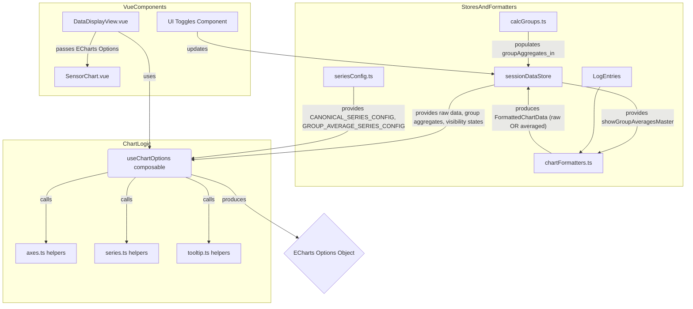

# Architectural Plan: Group Aggregate Data Plotting

This plan outlines the architectural changes required to visually represent `GroupAggregate` data alongside existing detailed time-series data in the charting application. The core idea is to introduce a two-grid chart layout when a master toggle is active: an upper grid for group averages and a lower grid for detailed (or averaged) time-series data.

**I. Data Structures & State Management**

1.  **New Series Configuration (`chart/src/stores/seriesConfig.ts`):**

    - Define a new exported constant array `GROUP_AVERAGE_SERIES_CONFIG`.
    - This array will contain configuration objects for each plottable metric from the `GroupAggregate` interface (e.g., `avg_speed_kmh`, `avg_current`, `avg_rpm`).
    - Each configuration object will include:
      - `displayName: string` (e.g., "Avg Speed (Group)")
      - `internalId: string` (e.g., `group_avg_speed_kmh`)
      - `dataKey: string` (the corresponding key in the `GroupAggregate` object)
      - `unit: string`
      - `decimals: number`
      - `color?: string` (optional, for consistent series color)
      - `yAxisIndex: number` (this will be an index relative to the y-axes defined for the _new upper chart grid_).

2.  **Store Enhancements (`chart/src/stores/sessionDataStore.ts`):**
    - Add new reactive state properties:
      - `groupAggregates: Ref<GroupAggregate[]> = ref([])` (to store the output of the `calculateGroupAggregates` function).
      - `showGroupAveragesMaster: Ref<boolean> = ref(false)` (for the master toggle controlling the visibility of the group averages feature; this state should be persisted to localStorage).
      - `groupAverageSeriesVisibility: Ref<Record<string, boolean>> = ref({})` (to store the visibility state of individual group average series, keyed by their `internalId`; this state should also be persisted to localStorage).
    - Ensure `groupAggregates` is populated when `calculateGroupAggregates` completes.
    - Implement actions to update `showGroupAveragesMaster` and `groupAverageSeriesVisibility` (e.g., `setGroupAverageSeriesVisibility(internalId, isVisible)`).
    - The `sessionDataStore` must make the `showGroupAveragesMaster` state available to `chartFormatters.getChartFormattedData`, either by passing it as an argument during the call or by including it in the `ChartFormatterContext`.

**II. Data Formatting Logic (`chart/src/stores/chartFormatters.ts`)**

1.  **Modify `getChartFormattedData` function (or its `ChartFormatterContext`):**
    - The function must receive or have access to the `showGroupAveragesMaster: boolean` state from `sessionDataStore`.
2.  **Conditional Data Point Generation for Main (Lower Grid) Series:**
    - Within `getChartFormattedData`, when iterating through `CANONICAL_SERIES_CONFIG` to prepare `seriesChartData` for each detailed series (currently around lines 334-358):
      - `if (showGroupAveragesMaster is true)`:
        - For the current detailed series, calculate its 3-second moving average across all `sortedUniqueTimestampMillis` using the values from `dataPointsMap`.
        - The `seriesChartData.push([new Date(tsMillis), averaged_value])` call will use this `averaged_value`.
        - **Important:** The `displayName` for the series (used in the legend) will remain unchanged from `CANONICAL_SERIES_CONFIG`. The switch to averaged data is silent in terms of legend text.
      - `else (showGroupAveragesMaster is false)`:
        - Use the existing logic: push the direct or interpolated values from `dataPointsMap` to `seriesChartData`.
3.  **Moving Average Calculation Utility:**
    - A new helper function will be required (e.g., in `chart/src/utils/calcSeries.ts` or as a local helper within `chartFormatters.ts`).
    - Signature: `calculateMovingAverageForSeries(points: Array<[Date, number | null]>, windowMs: number): Array<[Date, number | null]>`. This function will take an array of timestamped data points and the window size (3000ms) and return a new array of timestamped averaged values.

**III. Core Chart Logic Modifications (`chart/src/components/ChartOptions.ts` - `useChartOptions` composable)**

1.  **Update `useChartOptions` Signature:**
    - Add new reactive parameters:
      - `groupAggregates: Ref<GroupAggregate[]>`
      - `showGroupAveragesMaster: Ref<boolean>`
      - `groupAverageSeriesVisibility: Ref<Record<string, boolean>>`
      - `groupAverageSeriesConfigs: Ref<SeriesConfig[]>` (passing the `GROUP_AVERAGE_SERIES_CONFIG`).
2.  **Conditional ECharts Option Structure (driven by `showGroupAveragesMaster.value`):**

    - **If `showGroupAveragesMaster.value === true` (Two-Grid Layout):**

      - **Grids:**
        - `grid[0]` (Upper Grid for Group Averages): Define `top`, `height` (e.g., 25-30%), `left`, `right`.
        - `grid[1]` (Lower Grid for Detailed/Averaged Data): Define `top` (below upper grid), `height`, `left`, `right`.
      - **X-Axes:**
        - `xAxis[0]`: For `gridIndex: 0`, `type: 'time'`. Consider `show: false`.
        - `xAxis[1]`: For `gridIndex: 1`, `type: 'time'` (adapting existing x-axis).
        - **Linkage:** Configure `tooltip.axisPointer.link = { xAxisIndex: 'all' }`.
      - **Y-Axes:**
        - Generate a new set of y-axes for `grid[0]` based on visible group average series and their units/scales (from `GROUP_AVERAGE_SERIES_CONFIG`).
        - Adapt existing y-axis generation logic for `grid[1]`, ensuring `gridIndex: 1` is set.
      - **Series:**
        - **Upper Grid Series:** Generate from `groupAggregates` and visible `GROUP_AVERAGE_SERIES_CONFIG`. Data points will form horizontal lines for each group's duration (e.g., `[[group.start_time, metric_value], [group.end_time, metric_value]]`). Assign `xAxisIndex: 0` and the correct upper grid `yAxisIndex`.
        - **Lower Grid Series:** The data for these series will come from `chartFormattedData.value.series`. This data will already be 3-second moving averages (if `showGroupAveragesMaster` is true) or raw/interpolated (if false), due to the changes in `chartFormatters.ts`. These series will use `xAxisIndex: 1`. Legend names will remain as per `CANONICAL_SERIES_CONFIG`.
      - **Legends:**
        - `legend[0]` (or a new legend object): For the upper grid series. Populate `data` (names of visible group average series) and `selected` (from `groupAverageSeriesVisibility`). Position this legend _above_ the upper grid.
        - `legend[1]` (or adapt existing legend object): For the lower grid series. Its names will not change based on whether data is averaged or raw. Adjust position if necessary.
      - **DataZoom:** Configure to control both x-axes (`xAxisIndex: [0, 1]`).
      - **Tooltip:** Enhance `createTooltipFormatter` to display data from both linked grids when hovered.

    - **If `showGroupAveragesMaster.value === false` (Single-Grid Layout):**
      - The chart options structure will largely follow the current implementation (single grid, x-axis, y-axes, legend).
      - The data for series will be raw/interpolated as `chartFormatters.ts` will not apply moving averages.

**IV. Helper Function Adjustments (in `chart/src/components/chart/` and `chart/src/utils/`)**

1.  **`axes.ts`:**
    - Develop new functions to define y-axis configurations (`YAxisConfig`) and build ECharts y-axis options specifically for the _upper grid_.
    - Modify existing y-axis functions to accept a `gridIndex` parameter for proper association.
2.  **`series.ts`:**
    - Create a new function `buildGroupAverageSeriesOptions(groupAggregates, visibleGroupAverageSeriesConfigs, upperGridYAxes)` to generate ECharts series objects for the upper grid.
    - Ensure `buildSeriesOptions` (for the lower grid) correctly uses `xAxisIndex: 1` and y-axes associated with `gridIndex: 1`. It will consume data that's already appropriately (raw or averaged) formatted by `chartFormatters.ts`.
3.  **`tooltip.ts`:**
    - Adapt `createTooltipFormatter` to handle the two-grid scenario. It will need access to configurations and data from both grids if tooltips are to be comprehensive across linked axes.
4.  **New Moving Average Utility (e.g., in `chart/src/utils/calcSeries.ts`):**
    - Implement `calculateMovingAverageForSeries(points: Array<[Date, number | null]>, windowMs: number): Array<[Date, number | null]>`.

**V. UI Controls (New or Existing Vue Component)**

1.  Implement a master toggle switch in the UI, bound to `sessionDataStore.showGroupAveragesMaster`.
2.  When the master toggle is ON, display individual toggle switches for each series defined in `GROUP_AVERAGE_SERIES_CONFIG`. These will be bound to `sessionDataStore.groupAverageSeriesVisibility[series.internalId]`.
3.  These UI controls will dispatch actions to `sessionDataStore` to update the corresponding state.

**Mermaid Diagram of Key Component Interactions (Simplified):**

This plan provides a comprehensive approach to implementing the group aggregate data visualization, ensuring clarity and addressing the specific requirements for data presentation and user control.
