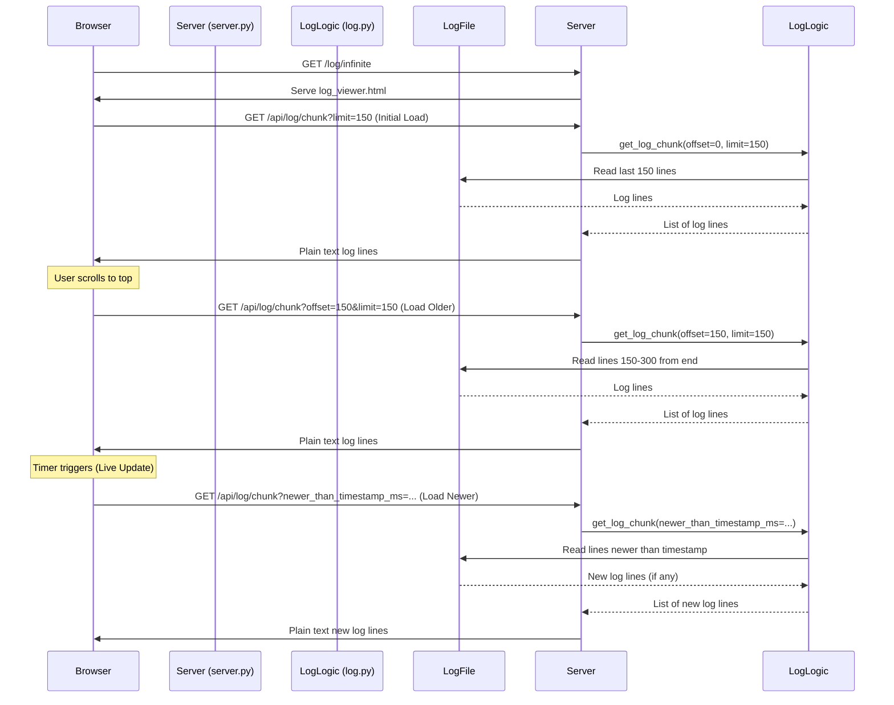

# Plan: Infinite Scrolling Log Viewer

Based on the requirements, here is the plan to implement the infinite scrolling log viewer:

**1. Modify `device/log.py`:**

- **Enhance `get_recent_logs` (or create a new function `get_log_chunk`):**
  - Add parameters `offset` (default 0) and `limit` (default 100) to fetch specific slices of the log file, reading _backwards_ from the end.
  - Add an optional parameter `newer_than_timestamp_ms` (default None). If provided, the function should efficiently find and return only log lines _newer_ than this timestamp (milliseconds). This will require parsing the timestamp from each log line during the read process.
  - The function should continue to return a list of log line strings.

**2. Modify `device/server.py`:**

- **Keep `/log` route:** No changes needed here. It will continue to use `get_recent_logs()` with default parameters (implicitly fetching the latest 100 lines).
- **Add `/log/infinite` route:**
  - Method: `GET`
  - Action: Serve a new static HTML file: `device/log_viewer.html`.
- **Add `/api/log/chunk` route:**
  - Method: `GET`
  - Parameters:
    - `offset` (integer, optional, default 0): Starting line offset from the _end_ of the log file.
    - `limit` (integer, optional, default 150): Maximum number of lines to return.
    - `newer_than_timestamp_ms` (integer, optional, default None): Return lines newer than this timestamp.
  - Action:
    - Parse the query parameters.
    - Call the enhanced `get_recent_logs` (or `get_log_chunk`) function in `log.py` with the parsed parameters.
    - Return the resulting list of log lines joined by newline characters (`\n`) with a `Content-Type` of `text/plain`.

**3. Create `device/log_viewer.html`:**

- **HTML Structure:**
  - A container element (e.g., `<pre id="log-container">`) to display the log lines.
  - Basic styling for readability.
- **JavaScript Logic:**
  - **Initial Load:**
    - On page load, make an AJAX request to `/api/log/chunk?limit=150` (or another suitable initial line count representing ~1.5 screens).
    - Populate `#log-container` with the response.
    - Store the timestamp (in milliseconds) of the _newest_ log line received.
    - Store the current `offset` (which will be 150 after the first load).
  - **Infinite Scroll (Older Logs):**
    - Add a scroll event listener to the window or the log container.
    - When the user scrolls near the _top_ of the content:
      - Make an AJAX request to `/api/log/chunk?offset=<current_offset>&limit=150`.
      - _Prepend_ the received log lines to the `#log-container`.
      - Increment the `current_offset` by the number of lines received (or 150).
      - Add a mechanism to prevent multiple simultaneous requests while one is loading.
  - **Live Update (Newer Logs):**
    - Use `setInterval` to periodically (e.g., every 2-5 seconds) make an AJAX request to `/api/log/chunk?newer_than_timestamp_ms=<last_newest_timestamp_ms>`.
    - If new lines are received:
      - _Append_ them to the `#log-container`.
      - Update the `last_newest_timestamp_ms` with the timestamp of the newest line received in this update.

**Diagram:**

**Summary of Changes:**

- **`device/log.py`:** Update log fetching logic for offset, limit, and timestamp filtering.
- **`device/server.py`:** Add two new routes (`/log/infinite` and `/api/log/chunk`).
- **New File:** `device/log_viewer.html` containing HTML and JavaScript for the UI and interaction.
