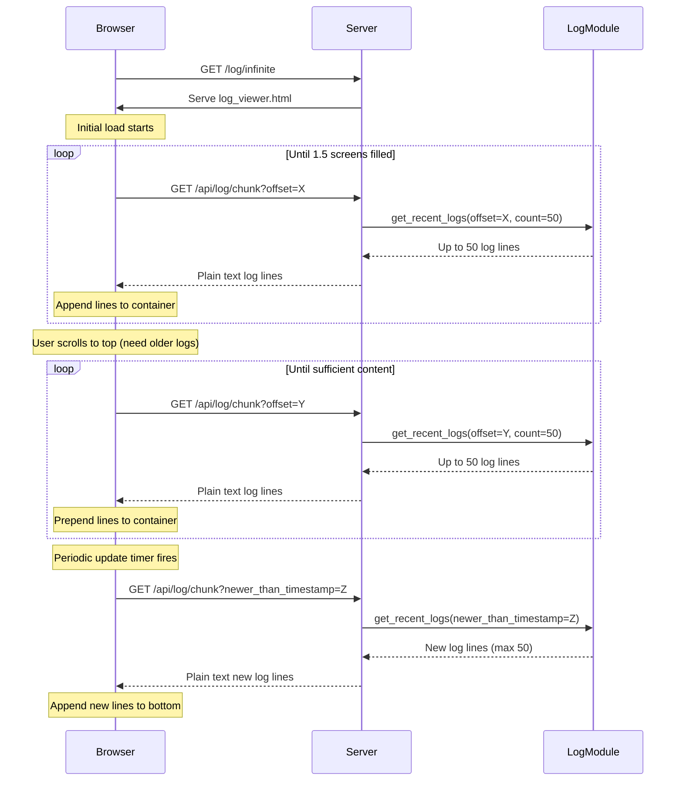

# Updated Plan: Infinite Scrolling Log Viewer with Memory Constraints

Based on the updated requirements and memory constraints, here is the adjusted plan:

**1. Add constants to `device/log.py`:**

- Add `MAX_LOG_LINES = 50` as a constant to define the maximum number of log lines to return in a single request.

**2. Modify `get_recent_logs` in `device/log.py`:**

- Update the default `count` parameter to use `MAX_LOG_LINES` instead of 100.
- Add parameter `offset` (default 0) to fetch specific slices of the log file, reading _backwards_ from the end.
- Add an optional parameter `newer_than_timestamp` (default None). If provided, efficiently find and return only log lines _newer_ than this timestamp.
- The function should continue to return a list of log line strings.
- Enforce the `MAX_LOG_LINES` limit for memory constraints.

**3. Modify `device/server.py`:**

- **Update existing `/log` route:**

  - Change to use `get_recent_logs()` with default parameters (fetching latest 50 lines instead of 100).

- **Add `/log/infinite` route:**

  - Method: `GET`
  - Action: Serve a new static HTML file: `device/log_viewer.html`.

- **Add `/api/log/chunk` route:**
  - Method: `GET`
  - Parameters:
    - `offset` (integer, optional, default 0): Starting line offset from the _end_ of the log file.
    - `newer_than_timestamp` (string, optional, default None): Return lines newer than this timestamp.
  - Action:
    - Parse the query parameters.
    - Call the enhanced `get_recent_logs` function with the parsed parameters.
    - Return the resulting list of log lines joined by newline characters (`\n`) with a `Content-Type` of `text/plain`.

**4. Create `device/log_viewer.html`:**

- **HTML Structure:**

  - A container element (e.g., `<pre id="log-container">`) to display the log lines.
  - Basic styling for readability.
  - Loading indicator for when requests are in progress.

- **JavaScript Logic:**

  - **Initial Load Function:**

    - Define a function to fetch initial logs that:
      - Makes requests to `/api/log/chunk?offset=0` followed by `/api/log/chunk?offset=50`, etc.
      - Performs enough requests to fill approximately 1.5 screens of content.
      - Continues making requests until either:
        - The container height is at least 1.5x the viewport height.
        - A request returns empty or fewer than 50 lines.
      - Tracks the timestamp of the newest log line for live updates.
      - Tracks the total offset for pagination.

  - **Scroll-Based Loading:**

    - Add a scroll event listener to detect when user is near the top of the log container.
    - When triggered, make multiple requests (with increasing offset values) until enough lines are loaded.
    - Add logic to prevent concurrent/overlapping requests during scrolling.

  - **Live Updates:**
    - Use `setInterval` to periodically check for new logs using the timestamp of the latest log.
    - Request newest logs with `/api/log/chunk?newer_than_timestamp=X`.
    - Append new logs to the container.
    - Each update fetches a maximum of 50 lines due to the server-side constraint.

**Memory Management Considerations:**

- All requests are limited to 50 lines maximum to prevent memory issues on the ESP32.
- Multiple sequential requests are used instead of larger batch sizes.
- The client-side logic handles combining multiple small responses into a seamless UI experience.
- Careful handling of scroll events to avoid request spamming.

**Sequence Flow:**

**Implementation Notes:**

- The UI will manage tracking offsets, current view state, and timestamps.
- The server will enforce the 50-line limit for all responses through the `MAX_LOG_LINES` constant.
- Timestamp parsing will need to be efficient to support the `newer_than_timestamp` parameter.
- Error handling should gracefully handle empty responses or server errors.
