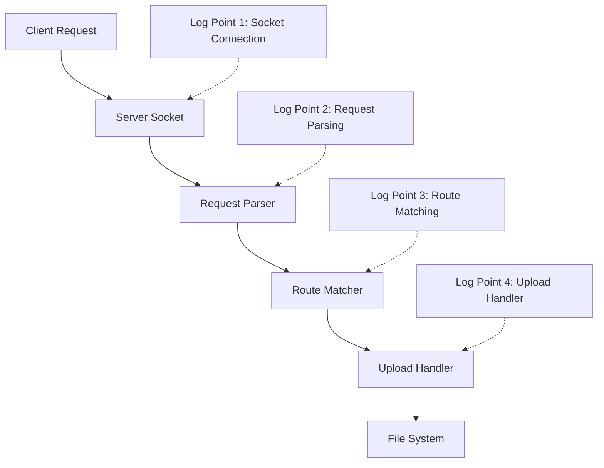

# ESP32 Upload Issue: Solution Plan

## Problem Analysis

Based on our investigation, we've identified that when you try to upload a file using `upload_chunked.sh`, the upload fails and there's no log indicating that the upload route was accessed. This suggests the request is either not reaching the server or is being mishandled early in the request processing pipeline.

## Most Likely Root Causes

1. **Request Parsing Issues**: The HTTP request may not be completely received or properly parsed
2. **Header Processing Problems**: The ESP32 server might not be correctly processing the headers sent by the upload script
3. **Content-Type Handling**: The binary content with `application/octet-stream` may not be handled correctly
4. **Route Matching Issues**: The request may be received but not correctly routed to the upload handler

## Solution Implementation Plan

### Phase 1: Enhanced Diagnostic Logging

Add strategic logging points to trace the request flow:



### Phase 2: Fix Implementation Steps

1. **Enhance HTTP Request Parsing**:

   - Improve the `parse_request` method to handle binary data correctly
   - Add explicit Content-Length validation
   - Ensure all necessary headers are captured regardless of case

2. **Fix Header Processing**:

   - Implement case-insensitive header lookup for critical headers
   - Validate all required headers early in the process
   - Add fallbacks for missing or malformed headers

3. **Improve Route Matching**:

   - Enhance the route matching logic to handle edge cases
   - Add more detailed logging during route resolution
   - Verify that prefix routes like `/upload/` are correctly matched

4. **Enhance Error Handling**:
   - Add comprehensive exception handling throughout the pipeline
   - Return more informative error responses
   - Log all exceptions with stack traces

### Phase 3: Testing and Verification

1. Create test files of various sizes:

   - Very small (1 byte)
   - Medium (10 KB)
   - Large (1 MB+)

2. Test multiple upload methods:

   - Direct binary upload
   - Chunked upload
   - Form-based upload

3. Verify proper error handling:
   - Malformed requests
   - Incomplete uploads
   - Edge cases (e.g., empty files)

## Code Changes Required

### 1. Server Request Parsing (server.py)

```python
def parse_request(self, client_socket, client_addr):
    try:
        log(f"Request parsing started from {client_addr[0]}")

        # Improved request data accumulation
        request_data = b""
        header_end = -1

        # First, get the headers
        while header_end == -1:
            chunk = client_socket.recv(1024)
            if not chunk:
                log("Connection closed while reading headers")
                return None

            request_data += chunk
            header_end = request_data.find(b"\r\n\r\n")

            # Safety check for extremely large headers
            if len(request_data) > 16384 and header_end == -1:  # 16KB max header size
                log("Headers too large, possible attack")
                return None

        # Process headers
        headers_data = request_data[:header_end].decode("utf-8")
        headers_lines = headers_data.split("\r\n")

        # Parse request line
        if not headers_lines:
            log("No request line found")
            return None

        try:
            method, path, _ = headers_lines[0].split(" ", 2)
            log(f"Request: {method} {path}")
        except ValueError:
            log(f"Invalid request line: {headers_lines[0]}")
            return None

        # Parse headers with case-insensitive keys
        headers = {}
        for line in headers_lines[1:]:
            if ":" in line:
                key, value = line.split(":", 1)
                headers[key.strip()] = value.strip()

        # Read body based on Content-Length
        body = request_data[header_end + 4:]
        content_length = 0

        # Case-insensitive content length lookup
        for key, value in headers.items():
            if key.lower() == "content-length":
                try:
                    content_length = int(value)
                    break
                except ValueError:
                    log(f"Invalid Content-Length: {value}")
                    return None

        log(f"Content-Length: {content_length}, Initial body size: {len(body)}")

        # Continue reading body if needed
        while len(body) < content_length:
            remaining = content_length - len(body)
            chunk = client_socket.recv(min(1024, remaining))
            if not chunk:
                log(f"Connection closed while reading body. Got {len(body)}/{content_length} bytes")
                break
            body += chunk

        log(f"Final body size: {len(body)}/{content_length}")

        # Create and return the request object
        request = Request(method, path, headers, body)
        request.client_addr = client_addr
        return request

    except Exception as e:
        log(f"Error parsing request: {e}")
        import sys
        sys.print_exception(e)
        return None
```

### 2. Upload Handler Enhancement (upload_sync.py)

```python
def handle_upload(request, target_path=None):
    """Handle file uploads, including chunked uploads"""
    try:
        log(f"Upload handler called for path: {target_path}")

        # Case-insensitive header lookup function
        def get_header(name):
            for key, value in request.headers.items():
                if key.lower() == name.lower():
                    return value
            return None

        # Get critical headers with case-insensitive lookup
        content_type = get_header("Content-Type") or ""
        content_type = content_type.lower()
        chunk_index = get_header("X-Chunk-Index")
        total_chunks = get_header("X-Total-Chunks")
        is_complete = get_header("X-Is-Complete") == "true"

        log(f"Upload request info: content_type={content_type}, chunk_index={chunk_index}, " +
            f"total_chunks={total_chunks}, is_complete={is_complete}")

        # Validate the upload request
        if not target_path:
            log("No target path specified")
            return json.dumps({"success": False, "error": "No target path specified"}), 400

        # Rest of the function with improved error handling...
```

## Next Steps

1. Review this detailed solution plan
2. Switch to Code mode for implementation:
   ```
   <switch_mode>
   <mode_slug>code</mode_slug>
   <reason>Need to implement code changes to fix the upload functionality</reason>
   </switch_mode>
   ```
3. After implementation, test with the diagnostic script provided in the troubleshooting guide

This plan addresses all identified potential root causes and provides a structured approach to fixing the upload issue.
