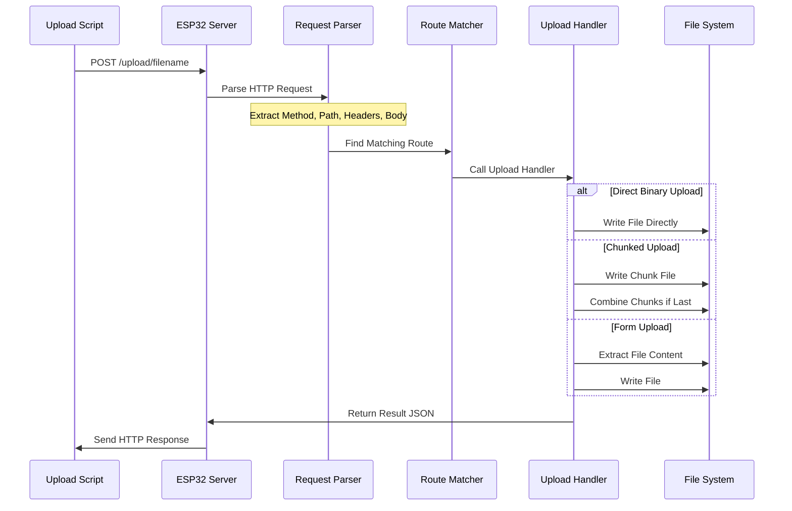

# ESP32 Upload Troubleshooting Guide

This guide provides a systematic approach to diagnose and fix the file upload issue you're experiencing with your ESP32 device.

## Diagnostic Script

You can create a diagnostic script to help troubleshoot the upload issue without changing the ESP32 code. Create a file called `diagnose-upload.sh` with the following content:

```bash
#!/bin/bash
# Diagnostic script for ESP32 upload issues

# Get the ESP32 IP address
SCRIPT_DIR="$( cd "$( dirname "${BASH_SOURCE[0]}" )" && pwd )"
if [ -f "$SCRIPT_DIR/ip" ]; then
    ESP_IP=$(cat "$SCRIPT_DIR/ip")
    echo "Using ESP32 IP address from file: $ESP_IP"
else
    ESP_IP="192.168.4.1"  # Default fallback
    echo "IP file not found, using default: $ESP_IP"
fi

# Clear the log first to avoid confusion
echo "Clearing previous logs..."
curl -s "http://$ESP_IP/log" > /dev/null

# Create a test file
echo "Test upload content" > test-upload.txt

echo -e "\n============ TESTING DIRECT BINARY UPLOAD ============"
echo "Sending direct binary upload request..."
curl -v -X POST \
  -H "X-Chunk-Index: 0" \
  -H "X-Total-Chunks: 1" \
  -H "Content-Type: application/octet-stream" \
  --data-binary "@test-upload.txt" \
  "http://$ESP_IP/upload/test-upload.txt"

echo -e "\n\n============ CHECKING LOGS ============"
sleep 1  # Give the server time to process and log
echo "Fetching logs..."
curl "http://$ESP_IP/log"

echo -e "\n\n============ TESTING CONNECTIVITY ============"
echo "Testing general server connectivity..."
curl -v "http://$ESP_IP/ping"

echo -e "\n\n============ TESTING ALTERNATE UPLOAD ============"
echo "Testing upload with different method (form upload)..."
curl -v -X POST \
  -F "file=@test-upload.txt" \
  "http://$ESP_IP/upload/test-upload.txt"

echo -e "\n\n============ FINAL LOG CHECK ============"
sleep 1  # Give the server time to process and log
curl "http://$ESP_IP/log"

# Clean up
rm test-upload.txt
```

Make the script executable and run it:

```bash
chmod +x diagnose-upload.sh
./diagnose-upload.sh
```

This script will:

1. Clear previous logs to avoid confusion
2. Create a test file to upload
3. Attempt a direct binary upload with detailed output
4. Check the logs to see what happened
5. Test general server connectivity
6. Try an alternative upload method (form upload)
7. Check the logs again

## Common Issues and Solutions

Based on our analysis of your codebase, here are the most likely issues and their solutions:

### 1. HTTP Request Not Reaching Server

**Signs:**

- No log entries for the upload request
- Connection errors in curl verbose output

**Solutions:**

- Verify the IP address is correct (check the `/ip` file)
- Ensure the ESP32 is powered and connected to the network
- Check if the server is running (try `/ping` endpoint)

### 2. Request Parsing Issues

**Signs:**

- Request appears in logs but is truncated
- No route match is found for valid URLs

**Solution Code:**

```python
# Modify server.py's parse_request method
def parse_request(self, client_socket, client_addr):
    try:
        # Ensure we handle binary content properly
        request_data = b""
        while b"\r\n\r\n" not in request_data:
            chunk = client_socket.recv(1024)
            if not chunk:
                break
            request_data += chunk

        # Check for complete headers
        if b"\r\n\r\n" not in request_data:
            log("Incomplete headers received")
            return None

        # Rest of the method...
```

### 3. Content-Type Handling

**Signs:**

- Request reaches server but the upload handler rejects it
- Logs show content type check failing

**Solution Code:**

```python
# In upload_sync.py, modify content type checking
content_type = request.headers.get("Content-Type", "").lower()
# Make sure we're doing case-insensitive comparison
if (
    "application/octet-stream" in content_type
    and chunk_index is not None
    and total_chunks is not None
):
    # Handle upload...
```

### 4. Header Case Sensitivity

**Signs:**

- Logs show the headers exist but the handler doesn't detect them

**Solution Code:**

```python
# In upload_sync.py, use case-insensitive header lookup
def get_header(headers, key):
    """Get header value case-insensitively"""
    for k, v in headers.items():
        if k.lower() == key.lower():
            return v
    return None

# Then use:
chunk_index = get_header(request.headers, "X-Chunk-Index")
total_chunks = get_header(request.headers, "X-Total-Chunks")
```

## Implementation Strategy

After identifying the issue with the diagnostic script, follow these steps:

1. Make a backup of your current code
2. Implement the specific fix for your identified issue
3. Reset the ESP32 to load the updated code
4. Test the upload again

## Comprehensive Debugging Implementation

For in-depth debugging, I recommend switching to Code mode to:

1. Add comprehensive logging throughout the request processing pipeline
2. Include detailed error handling that produces actionable error messages
3. Implement the specific fixes identified by the diagnostic process

## Mermaid Diagram of Request Flow

Here's a visual representation of how the upload request should flow through your system:



Use this diagram to understand where the process might be breaking down in your system.
